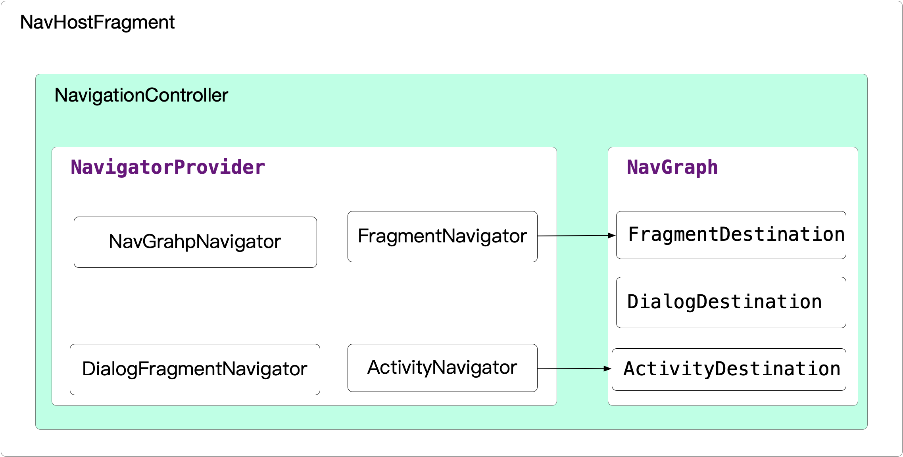

## Day1

#####  1.NavigationController#handleDeepLink


如果外部应用打开客户端并携带了uri: ppjoke://page/pageD ,那么 A、B、C、D都会被打开


##### 2.Navigation

Navigation各类之间的关系




##### 2. NavProcessor  destination注解处理器

- 需要把工程的gradle-wrapper和gradle-plugin分别降低到4.10.1，3.2.0。[详细原因](<https://github.com/gradle/gradle/issues/1471>)

- 如果不想降级gradle，那么必须在`libnavcompiler`中额外添加依赖

  ```java
  annotationProcessor 'com.google.auto.service:auto-service:1.0-rc6'
  ```

```java
implementation project(':libnavannotation')

implementation 'com.alibaba:fastjson:1.2.59'

api 'com.google.auto.service:auto-service:1.0-rc6'

```


## Day2

- 网络库的封装

  ```java
   implementation 'com.squareup.okhttp3:okhttp:4.2.0'
   implementation 'com.squareup.okhttp3:logging-interceptor:3.5.0'
  ```

- Room数据库缓存

  ```java
  implementation 'android.arch.persistence.room:runtime:1.1.1'
      implementation "android.arch.lifecycle:extensions:1.1.1"
      annotationProcessor 'android.arch.persistence.room:compiler:1.1.1'
      annotationProcessor "android.arch.lifecycle:compiler:1.1.1"
  ```

- 泛型类型获取

  - [参考文档](<https://blog.csdn.net/harvic880925/article/details/50085595>)

  - 从Java 5开始class文件的格式有了调整，规定这些泛型信息要写到java文件中，没有显示明确声明泛型类型的，会被编译器在编译时擦除掉。比如`new ArrayList<User>`传递的泛型类型会被擦除。

  - 但是` new Interface `出传递的泛型类型运行时是能获取到的，因为编译时会生成`Interface `的匿名内部类，内部类已经显示明确生命了泛型的类型。不会被擦除

    ```java
    class InnerClass implements Interface<List<User>>{
     ParameterizedType type =    (ParameterizedType)getClass().getGenericSuperclass()
     Type actual = type.getActualTypeArguments()[0];
     //actual就是List<User>类型的
    }
    ```


- Response数据结构体

  ```json
  {
      "status":200,
      "message":"成功",
      "data":{
          "data":{}
         // "data":[],
      }
  }
  ```

##  Day3
```java
//刷新分页组件
api 'com.scwang.smartrefresh:SmartRefreshLayout:1.1.0'
api 'com.scwang.smartrefresh:SmartRefreshHeader:1.1.0'

//exo播放器
api 'com.google.android.exoplayer:exoplayer-core:2.10.4'
api 'com.google.android.exoplayer:exoplayer-dash:2.10.4'
api 'com.google.android.exoplayer:exoplayer-ui:2.10.4' 

//viewmodel and livedata
api 'androidx.lifecycle:lifecycle-extensions:2.1.0'

//或者指明仅仅使用 livedata、viewmodel
api "androidx.lifecycle:lifecycle-viewmodel:2.1.0"
api 'androidx.lifecycle:lifecycle-livedata:2.1.0'      

//paging分页组件
api 'androidx.paging:paging-runtime:2.1.0'
```

##### 1.PagedList只支持查询(get)，不支持增删改，如何实现呢？

##### 2.paging如何做到上拉分页时手动触发数据请求并更新页面？

##### 3.DiffUtil原理之[Myers 差分算法](<https://www.jianshu.com/p/aac191f0b1ee>)


##### LiveData时序图


##### paging执行刷新流程


## Day4

QQ快捷登录
自己：Appid:101941206,AppKey:00e1b8e09e68b8ed965508f080b714d8
[QQ互联](<https://connect.qq.com/?id=1>)平台申请注册应用，AppId:101794421,AppKey:54689cdfd321c4fbe47fbd39dcdccad6

```java
implementation files('libs/open_sdk_r6140_lite.jar')
```


```java
<!-- 注册SDKActivity -->
<activity
           android:name="com.tencent.tauth.AuthActivity"
           android:launchMode="singleTask"
           android:noHistory="true">
            <intent-filter>
              <action android:name="android.intent.action.VIEW" />
              <category android:name="android.intent.category.DEFAULT" />
              <category android:name="android.intent.category.BROWSABLE" />
              <data android:scheme="tencent101794421" />
            </intent-filter>
        </activity>
        <activity        android:name="com.tencent.connect.common.AssistActivity"
android:screenOrientation="portrait"              android:theme="@android:style/Theme.Translucent.NoTitleBar" />
```

[拉起登录](<https://wiki.connect.qq.com/%E7%99%BB%E5%BD%95-%E6%A0%A1%E9%AA%8C%E7%99%BB%E5%BD%95%E6%80%81>)

[获取QQ登录的用户信息](<https://wiki.connect.qq.com/get_user_info>)


## Day4

#### fitSystemWindow

他会请求window重新分发状态栏所在的矩形范围，以使得我们的沉浸式状态栏的布局也能够在状态之下显示。但是。如果是一个Activity嵌套的多个Fragment页面的。由于ViewGroup#dispatchApplyWindowInsets方法的约束，只有ViewGroup的第一个直接子View能够接受的到自适应状态栏的事件，其他的子View都无法接收到这个事件


## Day5

- 父类ViewHandler 实现评论列表、底部互动区域数据请求和绑定，行为事件处理，添加一条评论，空布局等功能

- ImageViewHandler实现头部、标题栏和评论列表的滑动联动效果

- 如何实现给PagedList添加一条item？通过创建`MutableItemKeyedDataSource`然后把新的数据和列表上之前的数据都拼接到``MutableItemKeyedDataSource`中，在通过`listAdapter#submitList`paging框架会拿当前提交的数据集合 和 之前展示的数据做差分异，只会在指定的位置上 移动&删除&更新。所以不用担心这种方式 会卡顿什么的

  

## Day6

- CameraX视频预览：

```java
 PreviewConfig config = new PreviewConfig.Builder()
                .setLensFacing(mLensFacing)
                .setTargetRotation(rotation)
                .setTargetResolution(resolution)
                .setTargetAspectRatio(rational)
                .build();
 preview = new Preview(config);
 
//除此之外还需要设置预览视频流回调事件，和textureview绑定。
//请注意textureview一定还要先移除再添加
preview.setOnPreviewOutputUpdateListener(new Preview.OnPreviewOutputUpdateListener() {
@Override
public void onUpdated(Preview.PreviewOutput output) {
textureView = mBinding.textureView;
ViewGroup parent = (ViewGroup) textureView.getParent();
parent.removeView(textureView);
parent.addView(textureView, 0);            textureView.setSurfaceTexture(output.getSurfaceTexture()   );}});
```

- CameraX点击拍摄照片

```java
imageCapture = new ImageCapture(new ImageCaptureConfig.Builder()
                .setTargetAspectRatio(rational)
                .setTargetResolution(resolution)
                .setLensFacing(mLensFacing)
                .setTargetRotation(rotation).build());
```

- CameraX视频录制

```java
videoCapture = new VideoCapture(new VideoCaptureConfig.Builder()
                .setTargetRotation(rotation)
                .setLensFacing(mLensFacing)
                .setTargetResolution(resolution)
                .setTargetAspectRatio(rational)
                .setVideoFrameRate(25)
                .setBitRate(3 * 1024 * 1024).build());
```

- 关联生命周期

```
CameraX.unbindAll();
CameraX.bindToLifecycle(this, preview, imageCapture, videoCapture);
```


## Day 7 

- 全屏预览

  - 图片的全屏预览我们使用PhotoView来实现，请注意它的scaleType需要设置成fitCenter,否则宽高可能会被裁减

  - 视频的全屏预览需要区分本地视频资源&网络视频资源

    ```java
    Uri uri = null;
    File file = new File(previewUrl);
    if (file.exists()) {
    DataSpec dataSpec = new DataSpec(Uri.fromFile(file));
    FileDataSource fileDataSource = new        FileDataSource();
    try {fileDataSource.open(dataSpec);
        uri = fileDataSource.getUri();
    } catch (FileDataSource.FileDataSourceException e) {
         e.printStackTrace(); }
        } else {
         uri = Uri.parse(previewUrl);
         }
    
    ProgressiveMediaSource.Factory factory = new ProgressiveMediaSource.Factory(new DefaultDataSourceFactory(this, Util.getUserAgent(this, getPackageName())));
    ProgressiveMediaSource mediaSource = factory.createMediaSource(uri);
    ```

    

## Day 8

- 视频无缝续播：

  - 页面切换时首页列表不能暂停播放，否则会有画面停顿现象
  - 详情页需要和列表页公用player播放器，否则视频会有缓冲加载现象
  - 详情页需要使用新的playerView承载视频流画面，否则会有view缺失现象

- 列表上各组件相对位置

  - ViewAnchorBehavior---一个view可以把另一个view作为锚点，布局在它的下面，复写`onMeasureChild`接管子View测量,否则列表的高将不能完全正常展示，复写`onLayoutChild`接管子View的布局

- 视频的手势滑动特效

  - ViewZoomBehavior--由于playerView并不是scrollingView.所以需要在behavior中使用ViewDragHelper来协助拦截分发手势
  - 惯性滑动可以使用ViewCompat#postOnAnimation(Runnable run)来实现

  

  ## Day 9 

  - 1.创建任务、2.输入参数、3.创建workRequest、4.加入队列、5.监听结果

  ```java
  //1.编写一个UploadFileWorker.class 继承自 Worker
  //2.创建输入参数
  Data inputData = new Data.Builder()
       .putString("key", "value")
       .putBoolean("key1", false)
       .putStringArray("key2", new String[]{})
       .build();
  
  //3.创建workrequest
  OneTimeWorkRequest request = new OneTimeWorkRequest
        .Builder(UploadFileWorker.class)
        .setInputData(inputData)
        //........其它许许多多条件约束
        .build();
  
  // 4.加入队列
  WorkContinuation continuation = WorkManager.getInstance().beginWith(list).enqueue;
  
  // 5.观察执行状态 及结果      continuation.getWorkInfosLiveData().observe(this, new Observer<List<WorkInfo>>() {
     @Override
    public void onChanged(List<WorkInfo> workInfos) {
             //监听任务执行的结果
       }
   });
  ```

  

  

  


